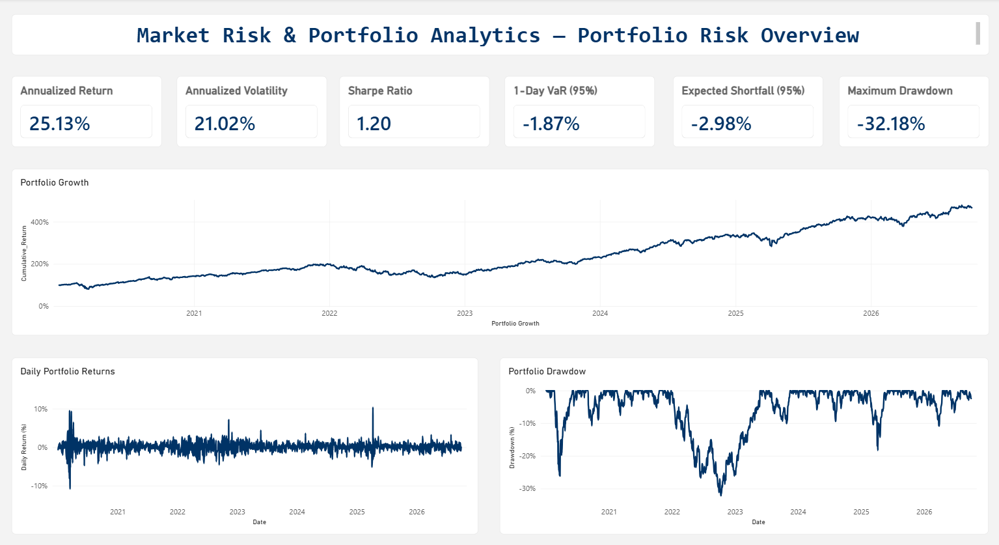
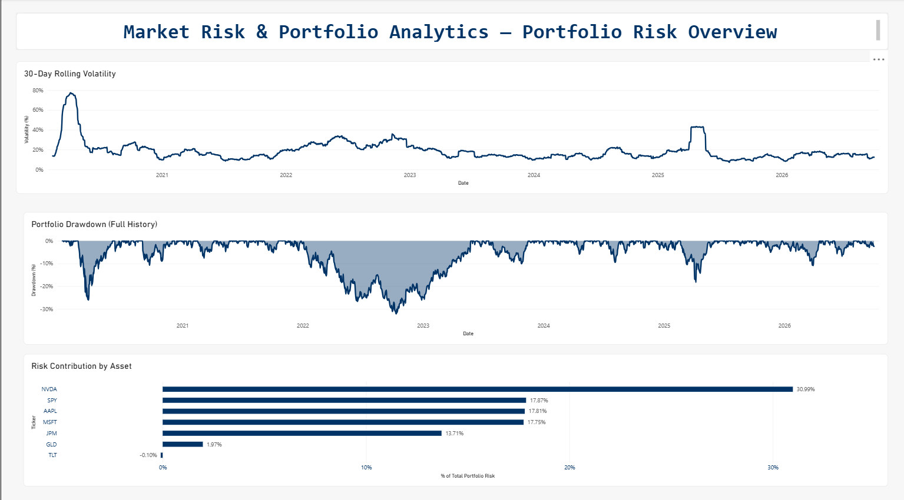
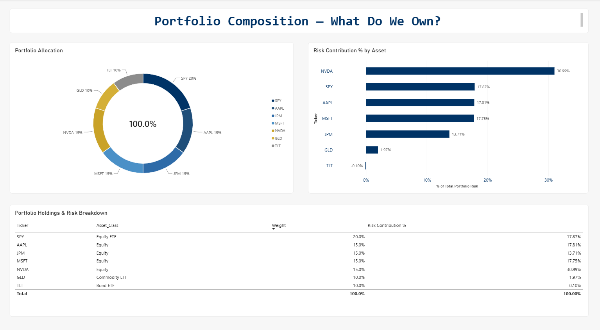
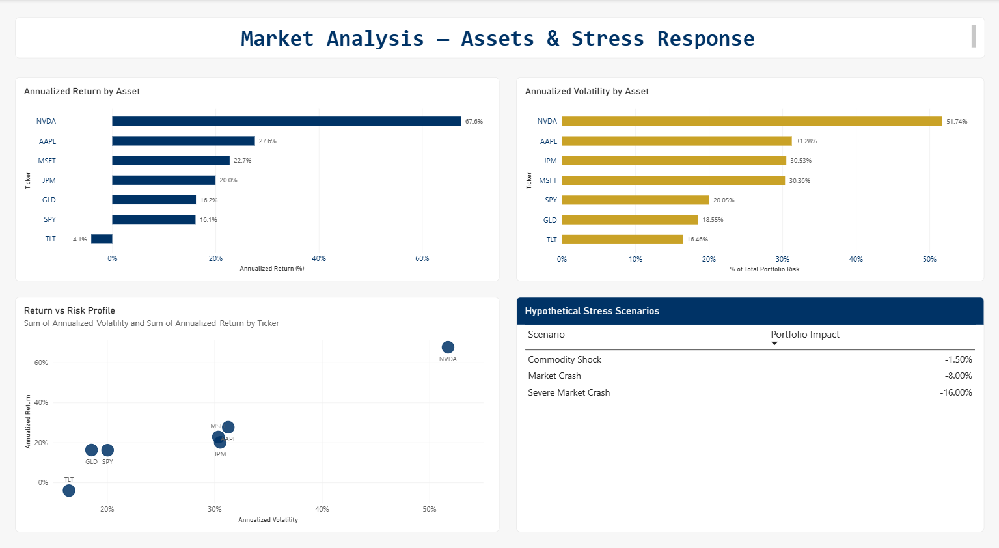

# Market Risk & Portfolio Analytics System

> **Python-based portfolio performance, volatility and market-risk analysis using historical financial market data, SQL analytics and Power BI.**

## Overview

The **Market Risk & Portfolio Analytics System** is an end-to-end financial analytics project designed to evaluate portfolio performance, quantify market risk, identify major risk contributors and present results through an interactive Power BI dashboard.

The project combines:

**Python → SQL → Power BI**

The analysis uses historical market data for a hypothetical multi-asset portfolio containing equities, equity ETFs, a commodity ETF and a bond ETF.

The project demonstrates practical capabilities in:

* Portfolio analytics
* Market-risk measurement
* Financial data preparation
* Volatility analysis
* Value at Risk (VaR)
* Expected Shortfall
* Drawdown analysis
* Risk contribution
* Stress testing
* SQL-based financial analytics
* Power BI dashboard development

---

## Business Objective

The objective is to build a practical analytical workflow that can answer questions such as:

* How has the portfolio performed over time?
* How volatile is the portfolio?
* What is the portfolio's historical downside risk?
* Which assets contribute most to overall portfolio risk?
* How large has the portfolio's historical drawdown been?
* How does portfolio performance compare with individual asset risk?
* How might the portfolio respond under hypothetical stress scenarios?

The project is intended as an analytical demonstration and **does not represent an actual client portfolio, investment recommendation or professional risk report**.

---

# Portfolio

The hypothetical portfolio consists of seven holdings:

| Ticker    | Asset Class   | Portfolio Weight |
| --------- | ------------- | ---------------: |
| AAPL      | Equity        |              15% |
| MSFT      | Equity        |              15% |
| JPM       | Equity        |              15% |
| NVDA      | Equity        |              15% |
| SPY       | Equity ETF    |              20% |
| GLD       | Commodity ETF |              10% |
| TLT       | Bond ETF      |              10% |
| **Total** |               |         **100%** |

### Portfolio construction note

SPY already contains exposure to several companies held individually in the portfolio, including AAPL, MSFT and NVDA.

Therefore, the portfolio has **overlapping economic exposure**. This is intentionally retained as a portfolio-analysis consideration rather than treating portfolio weights as independent exposures.

---

# Data

Historical market data was obtained using **yfinance** for the period:

**2020-01-01 to 2026-10-01**

The actual downloaded trading data covers:

**2020-01-02 to 2026-09-30**

### Raw dataset

The original market-data file contains:

* 1,695 trading-date observations
* 42 columns in the original multi-level format
* 0 missing values
* 0 duplicate dates

Stored at:

```text
data/raw/market_data_raw.csv
```

---

# Data Preparation

The raw market data was transformed from its original multi-level structure into a normalized long-format dataset.

### Cleaned dataset

**11,865 rows × 8 columns**

Columns:

```text
Date
Ticker
Adj_Close
Close
High
Low
Open
Volume
```

Stored at:

```text
data/processed/market_prices_clean.csv
```

Validation performed:

* Missing values: **0**
* Duplicate Date-Ticker combinations: **0**

---

# Return Calculation

Daily asset returns were calculated using adjusted closing prices:

```text
Daily Return = (P_t / P_(t-1)) - 1
```

The resulting return dataset is stored at:

```text
data/processed/market_returns.csv
```

Across the asset return dataset, the observed statistics were approximately:

| Statistic          |   Value |
| ------------------ | ------: |
| Mean daily return  | 0.0942% |
| Standard deviation | 1.9247% |
| Minimum            | -18.45% |
| Maximum            | +24.37% |

---

# Portfolio Return Engine

Daily portfolio returns were calculated using weighted asset returns:

```text
Portfolio Return =
Σ(Asset Weight × Asset Return)
```

The return calculation was implemented using complete observations across the portfolio constituents.

Portfolio return and risk calculations are stored at:

```text
data/processed/portfolio_returns_risk.csv
```

---

# Risk Analytics

The Python analysis calculates several portfolio and market-risk measures.

## Performance

### Annualized Return

The project uses arithmetic annualization:

```text
Average Daily Return × 252
```

This should **not be interpreted as CAGR**.

### Cumulative Portfolio Growth

Portfolio growth is calculated from cumulative daily returns and indexed to 100 for visualization.

The Power BI visualization is therefore labelled:

> **Portfolio Growth — Indexed to 100**

---

## Volatility

Annualized volatility is calculated as:

```text
Daily Standard Deviation × √252
```

A 30-day rolling volatility measure is also calculated to identify changes in portfolio risk over time.

---

## Sharpe Ratio

The project uses a simplified **0% risk-free rate** assumption.

The Sharpe ratio is therefore calculated using portfolio return relative to zero risk-free return and portfolio volatility.

---

## Historical Value at Risk

Historical **95% VaR** is calculated using the 5th percentile of the portfolio return distribution.

Conceptually:

```text
VaR 95% = 5th Percentile of Portfolio Returns
```

The measure provides an estimate of the portfolio's historical one-day downside threshold at the 95% confidence level.

---

## Expected Shortfall

Expected Shortfall measures the average portfolio return among observations that fall at or below the historical VaR threshold.

```text
Expected Shortfall 95%
=
Average Return of Observations ≤ VaR Threshold
```

This provides additional information about the severity of losses beyond the VaR boundary.

---

## Maximum Drawdown

Portfolio drawdown is calculated relative to the running portfolio peak:

```text
Drawdown =
Current Portfolio Value / Running Peak - 1
```

Maximum drawdown represents the largest observed decline from a previous portfolio peak.

---

# Portfolio Risk Contribution

Portfolio volatility is calculated using the covariance matrix:

```text
Portfolio Volatility = √(WᵀΣW)
```

where:

* **W** = portfolio weight vector
* **Σ** = asset return covariance matrix

The project then calculates marginal and asset-level risk contributions.

This analysis demonstrates an important portfolio-risk principle:

> **Portfolio weight does not equal portfolio risk contribution.**

For example, NVDA represents 15% of portfolio weight but contributes approximately **31% of portfolio risk** in the current analysis.

Approximate risk contributions:

| Asset | Risk Contribution |
| ----- | ----------------: |
| NVDA  |            30.99% |
| SPY   |            17.87% |
| AAPL  |            17.81% |
| MSFT  |            17.75% |
| JPM   |            13.71% |
| GLD   |             1.97% |
| TLT   |            -0.10% |

The slightly negative contribution from TLT can occur because of covariance and diversification effects.

---

# Stress Testing

The project includes simple hypothetical stress scenarios to evaluate portfolio sensitivity to adverse market movements.

### Market Crash

Equity and equity-ETF holdings:

```text
-10%
```

### Severe Market Crash

Equity and equity-ETF holdings:

```text
-20%
```

### Commodity Shock

GLD:

```text
-15%
```

These scenarios are **hypothetical sensitivity analyses, not forecasts or predictions**.

---

# Current Portfolio Results

Based on the current project dataset:

| Risk / Performance Metric |      Result |
| ------------------------- | ----------: |
| Annualized Return         |  **25.13%** |
| Annualized Volatility     |  **21.02%** |
| Sharpe Ratio              |    **1.20** |
| Historical VaR 95%        |  **-1.87%** |
| Expected Shortfall 95%    |  **-2.98%** |
| Maximum Drawdown          | **-32.18%** |

These values represent the current output of the project's historical dataset and methodology and should not be interpreted as forward-looking expectations.

---

# SQL Analytics

A MySQL database was created for structured financial analysis:

```text
market_risk_analytics
```

SQL analysis includes:

* Data validation
* Return analysis
* Asset-level statistics
* Monthly performance
* Portfolio returns
* Sharpe ratio
* Historical VaR
* Expected Shortfall
* Drawdown
* Volatility ranking
* Performance ranking
* Recent portfolio performance
* Dashboard-ready queries

SQL script:

```text
sql/market_risk_analytics.sql
```

---

## Power BI Dashboard

The Power BI dashboard provides an interactive view of portfolio performance, market risk, portfolio composition and asset-level analysis.

### 01 — Portfolio Risk Overview

**Focus:**

* Overall portfolio performance
* Key risk metrics
* Portfolio growth
* Daily returns
* Drawdown

**Key KPIs:**

* Annualized Return
* Annualized Volatility
* Sharpe Ratio
* 1-Day VaR 95%
* Expected Shortfall 95%
* Maximum Drawdown



---

### 02 — Market Risk — Risk Drivers & Volatility Analysis

**Focus:**

* Risk drivers
* Portfolio volatility
* Portfolio drawdown
* Asset-level risk contribution

**Key visuals:**

* 30-Day Rolling Volatility
* Portfolio Drawdown
* Risk Contribution by Asset



---

### 03 — Portfolio Composition

**Focus:**

* Portfolio allocation
* Asset-class exposure
* Weight versus risk contribution
* Portfolio exposure table



---

### 04 — Market Analysis

**Focus:**

* Annualized asset returns
* Annualized asset volatility
* Return versus risk
* Asset statistics
* Stress testing



---

**Power BI file:** `dashboard/Market_Risk_Analytics.pbix`

---

# Technology Stack

### Python

* Pandas
* NumPy
* yfinance
* Matplotlib
* Seaborn
* Jupyter Notebook

### SQL

* MySQL

### Visualization

* Microsoft Power BI

### Core Analytical Areas

* Financial data analysis
* Portfolio analytics
* Market-risk measurement
* Statistical analysis
* Data validation
* Risk reporting
* Dashboard development

---

# Project Workflow

```text
Historical Market Data
        ↓
Python Data Collection
        ↓
Data Cleaning & Validation
        ↓
Daily Return Calculation
        ↓
Portfolio Construction
        ↓
Performance & Risk Analytics
        ↓
Risk Contribution & Stress Testing
        ↓
MySQL / SQL Analytics
        ↓
Power BI Data Preparation
        ↓
Interactive Risk Dashboard
```

---

# Repository Structure

```text
Market_Risk_Analytics/
│
├── dashboard/
│   ├── Market_Risk_Analytics.pbix
│   ├── powerbi_market_prices.csv
│   ├── powerbi_asset_returns.csv
│   ├── powerbi_portfolio_returns.csv
│   ├── powerbi_portfolio_holdings.csv
│   ├── powerbi_asset_performance.csv
│   ├── powerbi_risk_metrics.csv
│   ├── powerbi_risk_contribution.csv
│   └── powerbi_stress_tests.csv
│
├── data/
│   ├── raw/
│   │   └── market_data_raw.csv
│   │
│   └── processed/
│       ├── market_prices_clean.csv
│       ├── market_returns.csv
│       ├── portfolio_holdings.csv
│       ├── portfolio_returns_risk.csv
│       └── portfolio_risk_summary.csv
│
├── notebooks/
│   ├── 01_market_data_collection.ipynb
│   └── 06_powerbi_data_preparation.ipynb
│
├── reports/
│   └── methodology.md
│
├── sql/
│   └── market_risk_analytics.sql
│
├── .gitignore
├── README.md
└── requirements.txt
```

---

# Limitations & Assumptions

This project is an analytical portfolio project and has several deliberate limitations.

### Market Data

Historical market data is sourced through yfinance and is intended for analytical demonstration rather than production risk reporting.

### Portfolio

The portfolio is hypothetical and does not represent an actual investment portfolio or client mandate.

### Annualized Return

Annualized return uses arithmetic annualization:

```text
Average Daily Return × 252
```

rather than compounded annual growth.

### Risk-Free Rate

The Sharpe ratio uses a simplified 0% risk-free-rate assumption.

### VaR

Historical VaR is distribution-based and does not assume a specific parametric return distribution.

### Stress Testing

Stress scenarios are deterministic hypothetical shocks and are not forecasts.

### Risk Model

The project does not implement a production-grade enterprise risk model, derivatives pricing engine or regulatory capital framework.

---

# Disclaimer

This project is intended solely for educational, analytical and portfolio-demonstration purposes.

It does not constitute investment advice, a recommendation to buy or sell securities, or a representation of professional market-risk reporting.

The portfolio, stress scenarios and analytical assumptions are hypothetical.

---

# Skills Demonstrated

This project demonstrates practical experience across:

**Financial Analytics**

* Portfolio performance analysis
* Volatility analysis
* VaR and Expected Shortfall
* Drawdown analysis
* Risk contribution
* Stress testing

**Data Analytics**

* Data collection
* Data cleaning
* Data validation
* Return calculations
* Statistical analysis
* Structured data preparation

**Technical**

* Python
* SQL
* MySQL
* Power BI
* Jupyter Notebook
* Data visualization

**Business / Risk**

* Risk-driver identification
* Portfolio exposure analysis
* Risk reporting
* KPI development
* Analytical dashboarding

---

## Project Status

**Completed**

* Market data collection
* Data cleaning and validation
* Return calculation
* Portfolio construction
* Portfolio risk engine
* Risk contribution analysis
* Stress testing
* MySQL analytics
* Power BI data preparation
* Power BI dashboard

**Status:** Complete analytical portfolio project.
